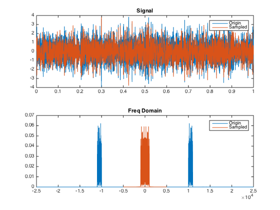

% 第二次编程作业
% 无36
  李思涵
  2013011187
  <lisihan969@gmail.com>
% \today

# 题目

某天线接收到的波形为两个实带通信号的迭加，其单边功率谱分别处于 10k-11kHz 和 12k-15kHz，
带内为白噪声（假设其分布为零均值的均匀分布），其功率分别为 1W 和 1e-6W。

- 为了对这个接收信号进行可重构采样分析，采样率最低要为多少?
- 如果采样后先进行均匀量化再存贮，希望保证无量化过载的情况下量化后信噪比达到 30dB，最少需要
  多少位量化?
- 如果要求最终分离出来的两个实带通信号信噪比均至少达到30dB，需要多少位量化?
- 理论计算，并编程仿真，画出原始波形，采样波形，采样频谱，重构波形，重构频谱；采样量化重构后的
  波形及频谱，重构误差波形及频谱

# 理论推导

## 最低采样率

由于信号的频率分量包括不相邻的两段，看起来我们在这里不能简单地使用带通抽样定理，而应该重新列出
抽样频率应该满足的关系，即存在整数 $a, b, c, d$，有以下关系成立：

\[
  \frac{2 \times 11000}{a + 1} \leq f_{s} \leq \frac{2 \times 10000}{a}
\]

\[
  \frac{2 \times 15000}{b + 1} \leq f_{s} \leq \frac{2 \times 12000}{b}
\]

\[
  \frac{15000 - 10000}{c + 1} \leq f_{s} \leq \frac{12000 - 11000}{c}
\]

\[
  \frac{11000 + 15000}{d + 1} \leq f_{s} \leq \frac{10000 + 12000}{d}
\]

解得 $f_{smin} = 10kHz$。实际上，这个结果和直接应用带通采样定律是一样的。这是因为，无法构造
出在中间频段非零的采样频率。

## 量化位数

易知采样间隔 $\Delta$，信号功率 $S$ 与信噪比的关系如下

\[
  SNR(dB) = 10\lg{\frac{S}{\frac{\Delta^2}{12}}}
\]

化简得到

\[
  \Delta = \sqrt{\frac{12S}{10^{SNR(dB) / 10}}}
\]

若希望保证无量化过载的情况下量化后信噪比达到 30dB，则
$S = 1.000001 \text{W}, SNR(db) = 30$，用上式计算得到 $\Delta = 0.110 \text{V}$。

如果要求分离出的两个实带通带通信号信噪比均达到 30dB，由于均匀量化的噪声强度与信号特征
无关，故我们只需要让功率较小的信号达到信噪比要求，功率较大的信号便可以自动满足。此时取
$S = 1 \times 10^{-6} \text{W}, SNR(db) = 30$，用上式计算得到
$\Delta = 1.10 \times 10^{-4} \text{V}$。

所以，我们只要通过实验得到信号的最大幅度 $V$，便可以通过下式计算得到量化位数：

\[
  \text{量化位数} = \lceil \log_2{\frac{2V}{\Delta}}) \rceil
\]

# 数值仿真

我们使用 MATLAB R2014b 进行试验。

## 生成信号

我们首先来生成符合要求的信号。我们的思路是，先生成一个高斯白噪声，在将其通过带通滤波器，然后
调整功率，从而生成题目所要求的信号。具体代码如下：

```matlab
close all

f_origin=50000;
T=1;

fl1 = 10e3;
fh1 = 11e3;
fl2 = 12e3;
fh2 = 15e3;

power1 = 1;
power2 = 1e-6;

t = 0:1/f_origin:T;
f_index = @(f, fs) round(T * mod(f, fs)) + 1;

rs = randn(1,length(t));
frs = fft(rs);

mask1 = zeros(1,length(t));
mask2 = mask1;

mask1(f_index(fl1, f_origin):f_index(fh1, f_origin)) = 1;
mask2(f_index(fl2, f_origin):f_index(fh2, f_origin)) = 1;

mask1(ceil((length(t) / 2) + 1):end) = flip(mask1(2:floor((length(t) / 2) + 1)));
mask2(ceil((length(t) / 2) + 1):end) = flip(mask2(2:floor((length(t) / 2) + 1)));

s1 = ifft(frs .* mask1) * sqrt(f_origin / sum(mask1) * power1);
s2 = ifft(frs .* mask2) * sqrt(f_origin / sum(mask2) * power2);

figure
subplot 211
plot(t, s1);
title s1
subplot 212
plot(t, s2);
title s2

s = s1 + s2;
```

信号波形如图所示。


## 采样

然后我们对原信号 $s$ 进行采样。这里我们使用我们理论推导得到的 10kHz 来对信号进行采样。

```matlab
% Sample.
f_sample = 10000;
t_sample = 0:1/f_sample:T;
s_sample = s(int32(round(t_sample * f_origin)) + 1);
fft_sample = fft(s_sample);

hold on

figure
subplot 211
plot(t, s, t_sample, s_sample);
legend Origin Sampled
title Signal

subplot 212
plot(fftshift(0:1/length(s):(1-1/length(s))) * f_origin - f_origin / 2, ...
     abs(fft(s)) / length(s), ...
     fftshift(0:1/length(s_sample):(1-1/length(s_sample))) * f_sample - f_sample / 2, ...
     abs(fft(s_sample)) / length(s_sample));
legend Origin Sampled
title 'Freq Domain'
```

得到的采样波形和频谱与原信号对比如图所示。



可以看到，采样后波形的频谱没有太大的变化，在频谱上与原信号没有重合则是因为其采样频率较低，频谱
减小了一个周期 1kHz。

## 采样重构

我们通过将采样后信号的频谱搬移回原位置的方法来进行重构，代码如下：

```matlab
% Rebuild.
f_rebuild = zeros(1, length(t));
f_rebuild(f_index(fl1, f_origin):f_index(fh1, f_origin)) = ...
    fft_sample(f_index(fl1, f_sample):f_index(fh1, f_sample)) * ...
    length(s) / length(s_sample);
f_rebuild(f_index(fl2, f_origin):f_index(fh2, f_origin)) = ...
    fft_sample(f_index(fl2, f_sample):f_index(fh2, f_sample)) * ...
    length(s) / length(s_sample);
f_rebuild(ceil((length(t) / 2) + 1):end) = ...
    conj(flip(f_rebuild(2:floor((length(t) / 2) + 1))));

s_rebuild = ifft(f_rebuild);

figure
subplot 211
plot(t, s, t, s_rebuild);
legend Origin Rebuilt
title Signal
subplot 212
plot(fftshift(0:1/length(s):(1-1/length(s))) * f_origin - f_origin / 2, abs(fft(s)), ...
     fftshift(0:1/length(s):(1-1/length(s))) * f_origin - f_origin / 2, abs(f_rebuild));
title 'Freq Domain'
legend Origin Rebuilt
```

得到的采样重构波形和频谱与原信号对比如图所示。


可以看到，重构后的信号和原信号基本上看不出差距。这说明我们的重构恢复了原信号的信息，说明我们的
采样确实没有丢失信号的信息。

## 量化

我们用 0.11V 作为步长对信号进行量化，然后画出重构分信号，总信号和误差的波形及频谱。

```matlab
delta = 0.11;
s_q1 = (floor(s_sample / delta) + 0.5) * delta;
fft_s_q1 = fft(s_q1);
s_q2 = (floor(s_sample / delta2) + 0.5) * delta2;
fft_s_q2 = fft(s_q2);

f_rebuild_q1 = zeros(1, length(t));
f_rebuild_q1(f_index(fl1, f_origin):f_index(fh1, f_origin)) = ...
    fft_s_q1(f_index(fl1, f_sample):f_index(fh1, f_sample)) * ...
    length(s) / length(s_sample);
f_rebuild_q1(ceil((length(t) / 2) + 1):end) = ...
    conj(flip(f_rebuild_q1(2:floor((length(t) / 2) + 1))));
s_q1_1 = ifft(f_rebuild_q1);

f_rebuild_q2 = zeros(1, length(t));
f_rebuild_q2(f_index(fl2, f_origin):f_index(fh2, f_origin)) = ...
    fft_s_q1(f_index(fl2, f_sample):f_index(fh2, f_sample)) * length(s) / length(s_sample);
f_rebuild_q2(ceil((length(t) / 2) + 1):end) = ...
    conj(flip(f_rebuild_q2(2:floor((length(t) / 2) + 1))));
s_q1_2 = ifft(f_rebuild_q2);

figure
subplot 211
plot(t, s_q1_1);
title s1
subplot 212
plot(t, s_q1_2);
title s2

figure
subplot 211
plot(t, s_q1_1 + s_q1_2);
title s
subplot 212
plot(fftshift(0:1/length(s):(1-1/length(s))) * ...
     f_origin - f_origin / 2, abs(fft(s_q1_1 + s_q1_2)));
title 'Freq Domain'

figure
subplot 211
plot(t, s_q1_1 + s_q1_2 - s_rebuild);
subplot 212
plot(fftshift(0:1/length(s):(1-1/length(s))) * f_origin - f_origin / 2, ...
     abs(fft(s_q1_1 + s_q1_2 - s_rebuild)));
title 'Freq Domain'
```


可以看到，重构出的总波形和 s1 的波形与原来没有什么区别，但 s2 则有有较大的差别。

然后，我们使用 $1.1 \times 10^{-4}$ 进行量化，代码和上面基本相似。

```matlab
delta = 1.1e-4;
s_q1 = (floor(s_sample / delta) + 0.5) * delta;
fft_s_q1 = fft(s_q1);
s_q2 = (floor(s_sample / delta2) + 0.5) * delta2;
fft_s_q2 = fft(s_q2);

f_rebuild_q1 = zeros(1, length(t));
f_rebuild_q1(f_index(fl1, f_origin):f_index(fh1, f_origin)) = ...
    fft_s_q1(f_index(fl1, f_sample):f_index(fh1, f_sample)) * length(s) / length(s_sample);
f_rebuild_q1(ceil((length(t) / 2) + 1):end) = ...
    conj(flip(f_rebuild_q1(2:floor((length(t) / 2) + 1))));
s_q1_1 = ifft(f_rebuild_q1);

f_rebuild_q2 = zeros(1, length(t));
f_rebuild_q2(f_index(fl2, f_origin):f_index(fh2, f_origin)) = ...
    fft_s_q1(f_index(fl2, f_sample):f_index(fh2, f_sample)) * length(s) / length(s_sample);
f_rebuild_q2(ceil((length(t) / 2) + 1):end) = ...
    conj(flip(f_rebuild_q2(2:floor((length(t) / 2) + 1))));
s_q1_2 = ifft(f_rebuild_q2);

figure
subplot 211
plot(t, s_q1_1);
title s1
subplot 212
plot(t, s_q1_2);
title s2

figure
subplot 211
plot(t, s_q1_1 + s_q1_2);
title s
subplot 212
plot(fftshift(0:1/length(s):(1-1/length(s))) * f_origin - f_origin / 2, ...
     abs(fft(s_q1_1 + s_q1_2)));
title 'Freq Domain'

figure
subplot 211
plot(t, s_q1_1 + s_q1_2 - s_rebuild);
subplot 212
plot(fftshift(0:1/length(s):(1-1/length(s))) * f_origin - f_origin / 2, ...
    abs(fft(s_q1_1 + s_q1_2 - s_rebuild)));
title 'Freq Domain'
```


这次我们可以看到，恢复出的 s1, s2 和总波形都没有什么失真。

我们来计算这两次量化所需要的位数：

```matlab
disp(['需要' int2str(ceil(log2(2 * max(abs(s)) / 0.11))) '位量化'])
disp(['需要' int2str(ceil(log2(2 * max(abs(s)) / 1.1e-4))) '位量化'])
% 需要7位量化
% 需要17位量化
```

可以看到，这两次量化分别需要 7 位和 17 位量化。
