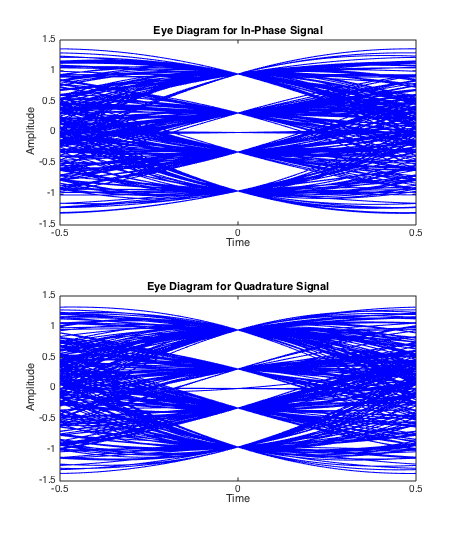

% 第四次编程作业 匹配滤波与最佳接收
% 无36
  李思涵
  2013011187
  <lisihan969@gmail.com>
% \today

# 题目

1. 编写一个含 QAM 传输的发送和接收模块
2. 分别采用复基带仿真和实带通仿真两种形式
3. 复基带仿真时过采样率为 4 倍，实带通仿真时过采样率为 20 倍，实带通仿真时，载波频率为符号率的
   4 倍
4. 发端采用滚降系数 0.5 的根号升余弦滤波器
5. 画出 Eb/N0 = 15dB 时的接收波形（收滤波前），取 100 个采样
6. 画出发端输出的眼图和收端过匹配滤波后的眼图（画眼图时不加噪声）
7. 统计误符号率和误比特率与 Eb/N0 的关系，画出曲线，与理论计算的曲线相对比

# 理论分析

## 误符号率/误符号率

对于 MQAM 信号，其误符号率公式为

\[
  P_{s,MQAM} = \frac{2(L - 1)}{L} Q[\sqrt{\frac{6\log_2{L}}{L^2 - 1} (\frac{E_b}{N_0})}]
\]

，误比特率公式为

\[
  P_{b,MQAM} = \frac{P_{s,MQAM}}{\log_2{L}}
\]

。对于 16QAM，$L = \sqrt{M} = 4$，故有

\[
  P_{s,16QAM} = \frac{3}{2} Q[\sqrt{\frac{4E_b}{5N_0}}]
\]

，误比特率公式为

\[
  P_{b,16QAM} \approx \frac{P_{s,16QAM}}{\log_2{L}} = \frac{P_{s,16QAM}}{2}
\]

## 信噪比

注意到，上式中对噪声使用的度量都是 $\frac{E_b}{N_0}$。为了仿真的方便，我们还需要
$\frac{E_b}{N_0}$ 与 $SNR$ 的关系。对于实信道：

\[
  SNR = \frac{2E_s}{N_0} = \frac{8E_b}{N_0}
\]

，对于复信道，有

\[
  SNR = \frac{E_s}{N_0} = \frac{4E_b}{N_0}
\]

## 符号 - 电平映射

我们使用采用格雷码的 16 QAM，星座图如图所示。


为了仿真和推导的方便，我们希望映射后的电平平均功率为 1。在假设各个符号出现概率均等的情况下，
对于复信道，平均功率即为星座图中所有点到原点距离平方的平均。对于实信道，平均功率为上述值的 1/2。

计算可知，复信道中星座图中一格应为 $\frac{1}{\sqrt{10}}$，实信道中应为
$\frac{2}{\sqrt{10}}$。

# 模块实现

## `qam_2l_convert.m`

实现符号到电平的映射。

```matlab
function signals = qam_2l_convert(symbols, method)
    [len, cols] = size(symbols);
    if mod(len, 2)
        error 'qam_2l_convert: mod(size(symbols, 1), 2) ~= 0'
    end

    symbols = symbols(:);
    signals = zeros(len / 2, cols);

    for k = 1:len
        signals(k) = 2 * symbols(2 * k - 1) + symbols(2 * k);
    end

    signals(signals == 0) = -3;
    signals(signals == 1) = -1;
    signals(signals == 3) = 1;
    signals(signals == 2) = 3;

    % Make sure averge power = 1 in QAM.
    switch method
    case 'real'
        signals = 2 * signals / sqrt(10);
    case 'complex'
        signals = signals / sqrt(10);
    end
end
```

## `qam_l_judge.m`

实现电平到比特流的判决。

```matlab
function symbols = qam_l_judge(signals)
    signals = sqrt(10) * signals;
    signals(signals >= 2) = 2;
    signals(signals >= 0 & signals < 2) = 3;
    signals(signals >= -2 & signals < 0) = 1;
    signals(signals < -2) = 0;

    [signal_len, cols] = size(signals);
    signals = signals(:);

    len = 2 * signal_len;
    symbols = zeros(len, cols);

    for k = 1:len
        symbols(2 * k - 1) = floor(signals(k) / 2);
        symbols(2 * k) = mod(signals(k), 2);
    end
end
```

## `qam_send.m`

16QAM 发端函数，依次进行如下操作：

1. 串-并变换
2. 2-L 电平转换
3. 根升余弦滤波器。这里我们使用了 `rcosdesign` 函数和 `upfirdn` 函数。
4. 分别与 0° 和 90° 的载波相乘
5. 将两路信号相加。

这里需要注意，在串-并变换和2-L 电平转换后符号率减小为了原来的 1/4，故余弦信号一个周期内的采样
点数为 `8 * f_carrier * oversample_rate`。

```matlab
% 16QAM.
% Average power = 1.
function signals = qam_send(symbols, f_carrier, oversample_rate, method)
    len = length(symbols);
    sample_rate = 8 * f_carrier * oversample_rate;

    left = mod(len, 4);
    if left
        warning 'Zero(s) will be added in front of input symbols.';
        symbols = [zeros(4 - left, 1); symbols];
        len = length(symbols);
    end

    % Serial => parallel.
    symbols = reshape(symbols, 2, len / 2)';

    % 2 -> L.
    signals = qam_2l_convert(symbols, method);

    % LPF,
    lpf = rcosdesign(0.5, 6, sample_rate);
    signals = upfirdn(signals, lpf, sample_rate);
    % eyediagram(signals, sample_rate, 1, 3);
    signal_len = size(signals, 1);

    % Get on carrier.
    switch method
    case 'real'
        carrier = [cos(pi / oversample_rate * (1:signal_len))
                   cos(pi / oversample_rate * (1:signal_len) + pi / 2)]';
    case 'complex'
        carrier = [exp(j * pi / oversample_rate * (1:signal_len))
                   exp(j * (pi / oversample_rate * (1:signal_len) + pi / 2))]';
    end
    signals = signals .* carrier;

    % Merge.
    signals = signals(:, 1) + signals(:, 2);
end
```

## `qam_receive.m`

16QAM 收端函数，依次进行如下操作：

1. 载波恢复
2. 根升余弦滤波器。同样地，这里我们使用了 `rcosdesign` 函数和 `upfirdn` 函数。
3. 判决 (L - 1) 门限
4. 并-串变换

```matlab
% 16QAM.
function symbols = qam_receive(signals, f_carrier, oversample_rate, method)
    signal_len = length(signals);
    sample_rate = 8 * f_carrier * oversample_rate;

    % Recover.
    switch method
    case 'real'
        carrier = [cos(pi / oversample_rate * (1:signal_len))
                   cos(pi / oversample_rate * (1:signal_len) + pi / 2)]';
    case 'complex'
        carrier = [exp(-j * pi / oversample_rate * (1:signal_len))
                   exp(-j * (pi / oversample_rate * (1:signal_len) + pi / 2))]';
    end
    signals = real([signals signals] .* carrier);
    % figure
    % plot(signals(1:sample_rate*100, :));

    % LPF
    lpf = rcosdesign(0.5, 6, sample_rate);
    % eyediagram(filter(lpf, 1, signals), sample_rate, 1, 3);
    signals = upfirdn(signals, lpf, 1, sample_rate);
    signals = signals(7:end-6, :);  % Caused by filter delay.

    % Judge & merge.
    symbols = qam_l_judge(signals)';
    symbols = symbols(:);
end
```

## `main.m`

由于生成的随机序列具有随机性，我们对每个 $\frac{E_s}{N_0}$ 都进行了多次循环，并取平均值。

```matlab
close all

LEN = 10000;
ITERS = 10;
ebn0 = -10:0.5:10;

error_bit_rate_real = zeros(length(ebn0), 1);
error_bit_rate_complex = zeros(length(ebn0), 1);
error_sym_rate_real = zeros(length(ebn0), 1);
error_sym_rate_complex = zeros(length(ebn0), 1);

parfor k = 1:length(ebn0)
    disp(['Eb/N0 = ' num2str(ebn0(k))]);
    snr_real = 10 * log10(8) + ebn0(k);
    snr_complex = 10 * log10(4) + ebn0(k);

    for iter = 1:ITERS
        symbols = logical([1; randi([0 1], LEN - 1, 1)]);

        % Real.
        signals = qam_send(symbols, 4, 20, 'real');
        signals = awgn(signals, snr_real);
        received = qam_receive(signals, 4, 20, 'real');

        error_bit_rate_real(k) = error_bit_rate_real(k) + ...
             sum(symbols ~= received) / LEN;
        error_sym_rate_real(k) = error_sym_rate_real(k) + ...
             sum(any(reshape(symbols ~= received, 2, LEN / 2))) / (LEN / 2);

        % Complex.
        signals = qam_send(symbols, 4, 4, 'complex');
        signals = awgn(signals, snr_complex);
        received = qam_receive(signals, 4, 4, 'complex');

        error_bit_rate_complex(k) = error_bit_rate_complex(k) + ...
            sum(symbols ~= received) / LEN;
        error_sym_rate_complex(k) = error_sym_rate_complex(k) + ...
            sum(any(reshape(symbols ~= received, 2, LEN / 2))) / (LEN / 2);
    end
    error_bit_rate_real(k) = error_bit_rate_real(k) / ITERS;
    error_bit_rate_complex(k) = error_bit_rate_complex(k) / ITERS;
    error_sym_rate_real(k) = error_sym_rate_real(k) / ITERS;
    error_sym_rate_complex(k) = error_sym_rate_complex(k) / ITERS;
end

% Draw figures.
figure

subplot 211
semilogy(ebn0, 3/2*(1 - normcdf(sqrt(2 * 4/5*10.^(ebn0 / 10)))) / 2, ...
         ebn0, error_bit_rate_real, 'LineWidth', 2);
xlabel E_b/N_0
ylabel P_b
legend Theoretical Actural
title Real

subplot 212
semilogy(ebn0, 3/2*(1 - normcdf(sqrt(4/5*10.^(ebn0 / 10)))) / 2, ...
         ebn0, error_bit_rate_complex, 'LineWidth', 2);
 xlabel E_b/N_0
 ylabel P_b
legend Theoretical Actural
title Complex

% Draw figures.
figure

subplot 211
semilogy(ebn0, 3/2*(1 - normcdf(sqrt(2 * 4/5*10.^(ebn0 / 10)))), ...
         ebn0, error_sym_rate_real, 'LineWidth', 2);
xlabel E_b/N_0
ylabel P_s
legend Theoretical Actural
title Real

subplot 212
semilogy(ebn0, 3/2*(1 - normcdf(sqrt(4/5*10.^(ebn0 / 10)))), ...
         ebn0, error_sym_rate_complex, 'LineWidth', 2);
 xlabel E_b/N_0
 ylabel P_s
legend Theoretical Actural
title Complex

%
% % Eb/N0 = 15dB
% symbols = logical([1; randi([0 1], LEN - 1, 1)]);
%
% % Real.
% signals = qam_send(symbols, 4, 20, 'real');
% signals = awgn(signals, 10 * log10(8) + 15);
% received = qam_receive(signals, 4, 20, 'real');
%
% % Complex.
% signals = qam_send(symbols, 4, 4, 'complex');
% signals = awgn(signals, 10 * log10(4) + 15);
% received = qam_receive(signals, 4, 4, 'complex');
```

# 仿真结果

## 15dB 时前 100 个采样

注意：这里理解的前 100 个采样指 100 个符号周期，因为由于滤波器的延时，前 100 个采样点啥都
没有呢还 `= =`。


从图中可以看到，由于在这里已经经过了载波恢复这一步，我们已经能隐约看出载波中承载的信息。同时，
可以发现复信号的波形更为显露。这是因为实信道仿真时过采样率更高。

## 误比特率/误符号率


从图中可以看出以下几点：

- 误符号率和误比特率的理论值和仿真值差异都不大，且二者都随 $\frac{E_s}{N_0}$ 的变大而变小。

    这说明我们的实现是正确的。乌拉！

- 当 $\frac{E_s}{N_0}$ 较小时，误比特率的理论值偏小。

    这是因为，我们理论推导出的误符号率时精确的，而误比特率公式中则假设一个符号错误对应一个比特
    错误。当噪声较小时，由于格雷码的性质，这个假设基本是正确的。然而，在噪声较大时，一个符号
    错误对应多个比特错误的几率大大增加了，故我们推导出的理论值是偏小的。

- 当 $\frac{E_s}{N_0}$ 较大时，仿真值在理论值周围的波动变大。

    这是由于我们的仿真次数有限。当信噪比很小的时候，多次仿真得到的误符号个数还是很少，故随机性
    比较大，更容易受输入信号的影响。

## 眼图




发端眼图和收端眼图如图所示。

从图中可以看出，在经过了一个根升余弦滤波器之后，信号在采样点受到了串扰的影响。而在经过了第二个
根升余弦滤波器后，信号相当于经过了一个升余弦滤波器，故在采样点无失真。

至于使用两个根余弦滤波器的原因，则是为了最大化采样点的信噪比。同时，第二个根余弦滤波器也起到了
低通滤波器的作用，将信号从载波上卸下来。
