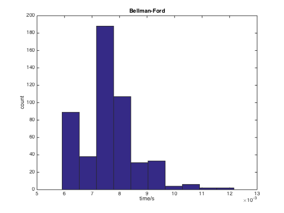
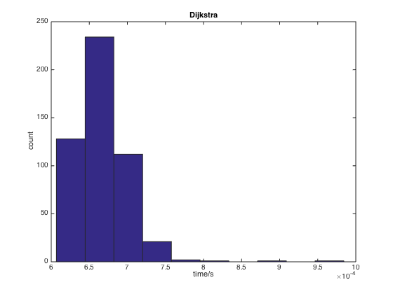

% 路由算法实现与比较
% 无36
  李思涵
  2013011187
  <lisihan969@gmail.com>
% \today

# 题目

编写 Bellman-Ford 和 Dijkstra 算法的程序，并在一个随机生成的 30 节点网络上验证你的算法，
给出算法收敛的时间统计分布。

# 代码实现

## 随机网络生成

为了能够检验两算法，我们首先实现网络的随机生成。我们用邻接表来描述网络，并根据给定的节点数和边
数生成邻接矩阵。具体代码实现如下：

```matlab
function adj_mat = gen_rand_net(nodes, edges)
    % Decide which edges to take.
    max_edges = (nodes - 1) * nodes / 2;
    edges = min(edges, max_edges);
    pick = zeros(max_edges, 1);
    pick(randsample(max_edges, edges)) = 1;

    adj_mat = zeros(nodes);

    k = 1;
    for row = 1:nodes
        for col = 1:row-1
            if pick(k)
                dis = rand();
            else
                dis = inf;
            end
            adj_mat(row, col) = dis;
            k = k + 1;
        end
    end
    adj_mat = adj_mat + adj_mat';
```

## Bellman-Ford 算法

```matlab
function [dist, next] = bellman_ford(adj_mat, src)
    nodes = size(adj_mat, 1);

    dist = adj_mat;
    next = repmat(1:nodes, [nodes, 1]) .* ~isinf(adj_mat);

    new_dist = zeros(nodes);
    while true
        for node = 1:nodes
            routes = repmat(adj_mat(:, node), [1, nodes]) + dist;
            [new_dist(node, :), index] = min(routes);
            updates = index ~= node;
            next(node, updates) = index(updates);
        end

        if all(all(new_dist == dist))
            break
        end

        dist = new_dist;
    end

    % Remove inaccessible entries in next.
    next(isinf(dist)) = 0;

    % Return only the data for src.
    dist = dist(src, :)';
    next = next(src, :)';
```

## Dijkstra 算法

```matlab
function [dist, next] = dijkstra(adj_mat, src)
    nodes = size(adj_mat, 1);
    done = false(nodes, 1);

    dist = inf(nodes, 1);
    next = zeros(nodes, 1);

    current = src;
    done(src) = 1;
    dist(src) = 0;
    next(src) = src;

    while true
        dist_from_current = dist(current) + adj_mat(current, :)';
        dist_from_current(done) = inf;  % Remove done (including self).

        % Update neighbors.
        updates = dist_from_current < dist;
        dist(updates) = dist_from_current(updates);
        if current == src
            next(updates) = find(updates);
        else
            next(updates) = next(current);
        end

        dist_now = dist;
        dist_now(done) = inf;
        [value, index] = min(dist_now);
        if isinf(value)
            break;
        else
            done(index) = 1;
            current = index;
        end
    end
```

## 测试与统计

为了减小随机性带来的影响，我们在每次随机生成的邻接矩阵上进行多次实验，并取平均值。最后我们通过
直方图来展示算法收敛时间的分布。具体代码如下：

```matlab
NODES = 30;
EDGES = 100;
SAMPLES = 500;
ITERS = 100;

samples = zeros(SAMPLES, 2);

for k = 1:SAMPLES
    disp(['Sample #' int2str(k)]);
    adj = gen_rand_net(NODES, EDGES);

    tic
    for iter = 1:ITERS
        bellman_ford(adj, 1);
    end
    samples(k, 1) = toc / ITERS;

    tic
    for iter = 1:ITERS
        dijkstra(adj, 1);
    end
    samples(k, 2) = toc / ITERS;
end

figure
hist(samples(:, 1))
title Bellman-Ford
xlabel time/s
ylabel count

figure
hist(samples(:, 2))
title Dijkstra
xlabel time/s
ylabel count
```

# 实验结果

实验结果如图所示。可以看到，在我们的实现中，Dijkstra 算法收敛的速度更快。不过需要注意的是，
Dijkstra 算法只能给出单源最短路径，而 Bellman-Ford 算法实际上能给出全源最短路径。

同时，可以看到网络结构对算法收敛确实有一定的影响。其中 Dijkstra 算法的收敛时间比较集中，说明
其稳定性更好一些。这是因为 Bellman-Ford 算法中迭代次数很依赖于网络结构，而在 Dijkstra 算法
中迭代次数只依赖于源所在联通区间的节点数。




